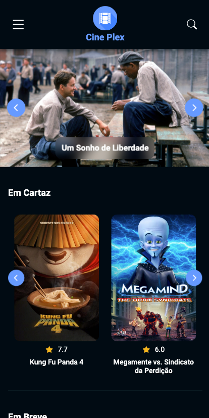

# Cine Plex

## Contexto

Este projeto trata-se de um site estilo catálogo de filmes (apenas para visualização, sem simulação de compras), desenvolvido para desktop e mobile (100% responsivo).

Está sendo desenvolvido com o intuito de se aprofundar no NextJS e no consumo de informações do banco de dados do TMDB (The Movie DB).

Além disto, está sendo utilizado para o aprendizado de testes:

- Testes unitários realizados com Vitest e React Testing Library;
- Testes E2E realizados com Playwright.

Toda a implementação está sendo realizada visando uma boa performance de navegação, além de atender aos critérios de acessibilidade e de SEO.

<h4>Prévia Desktop</h4>

&nbsp;

<h4>Prévia Mobile</h4>

&nbsp;

## Tecnologias usadas

<h4>Front-end</h4>

HTML5, SASS, ReactJS, re-state, Typescript, Embla Carousel, NextJS, eslint, prettier

&nbsp;

<h4>Testes</h4>

Vitest, React Testing Library, MSW, Playwright

&nbsp;

## Instalando as dependências

<h4>Front-end</h4>

yarn install

&nbsp;

## Testando a aplicação

<h4>Front-end - Testes unitários</h4>

yarn test

&nbsp;

<h4>Front-end - Testes E2E</h4>

yarn test:e2e

&nbsp;

## Executando a aplicação

<h4>Front-end</h4>

yarn dev

&nbsp;

## Link Vercel

https://cine-plex.vercel.app/
